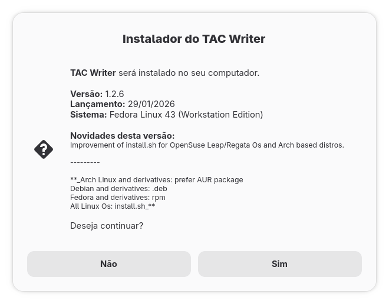

# TAC Writer Installer

<p align="center">
  
</p>

[](https://go.dev/)
[](https://www.kernel.org/)
[](https://en.wikipedia.org/wiki/Portuguese_language)
[](https://www.gnu.org/licenses/old-licenses/gpl-2.0.en.html)


A modern, lightweight graphical installer for [TAC Writer](https://github.com/narayanls/tac-writer), built with **Go** and **Zenity**. This tool simplifies the installation process for Linux users, automatically fetching the latest version of the software directly from the source.

---

## 🚀 Features

* **GUI Interface:** Friendly graphical dialogs powered by Zenity.
* **Version Control:** Automatically checks for new versions and downloads the latest release from the [official TAC Writer repository](https://github.com/narayanls/tac-writer).
* **Universal Compatibility:** Supports virtually all Linux distributions (Ubuntu, Fedora, Arch, Debian, openSUSE, Solus, etc.).
* **Streamlined Process:** No need for complex terminal commands; just follow the visual prompts.

> [!IMPORTANT]
> **Language Support:** Currently, both the installer and TAC Writer are available exclusively in **Portuguese (Brazil)**.

---

## 🛠️ Prerequisites

Before building and running the installer, you must install **Go** and **Zenity**. Use the command corresponding to your distribution:

* **Ubuntu / Debian:**
    ```bash
    sudo apt install golang zenity
    ```
* **Fedora / RHEL:**
    ```bash
    sudo dnf install golang zenity
    ```
* **Arch Linux:**
    ```bash
    sudo pacman -S go zenity
    ```
* **openSUSE (Leap or Tumbleweed):**
    ```bash
    sudo zypper install go zenity
    ```
* **Solus:**
    ```bash
    sudo eopkg install golang zenity
    ```

---

## 📥 How to Install & Run

Since there are no pre-compiled releases, follow these steps to build the installer from source:

1.  **Clone the repository:**
    ```bash
    git clone https://github.com/jyahyah/tac-installer.git
    cd tac-installer
    ```

2.  **Build the installer:**
    ```bash
    go build -o tac-installer
    ```

3.  **Run the application:**

    ### Via Terminal
    ```bash
    ./tac-installer
    ```

    ### Via File Manager (GUI)
    1. Right-click the file `tac-installer`.
    2. Go to **Properties** > **Permissions**.
    3. Check the box **"Allow executing file as program"** (or similar).
    4. **Double-click** the file to launch.

---

## ⚙️ How it Works

<p align="center">
  
</p>

The installer follows a simple, automated workflow:

1.  **API Query:** It pings the GitHub API of the [TAC Writer repository](https://github.com/narayanls/tac-writer) to find the most recent tag/release.
2.  **Environment Check:** Verifies if the system is compatible and has the necessary permissions.
3.  **Download & Setup:** Downloads the latest assets and configures the application on your system via the Zenity GUI.

---

## 📄 License

This project is licensed under the **GPL v2 License**. See the `LICENSE` file for more details.

---

## 🤝 Contributing

Contributions are welcome! If you encounter any bugs or have suggestions for new features, feel free to open an **Issue** or submit a **Pull Request**. 

*Note: Since the software targets the Brazilian community, feel free to open issues in Portuguese.*
